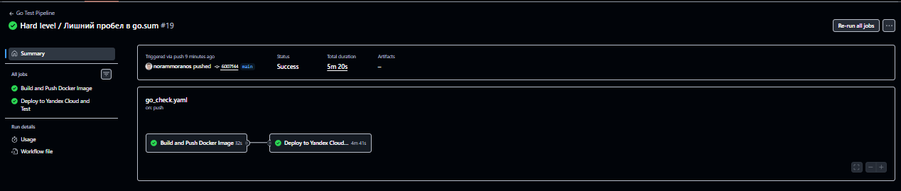
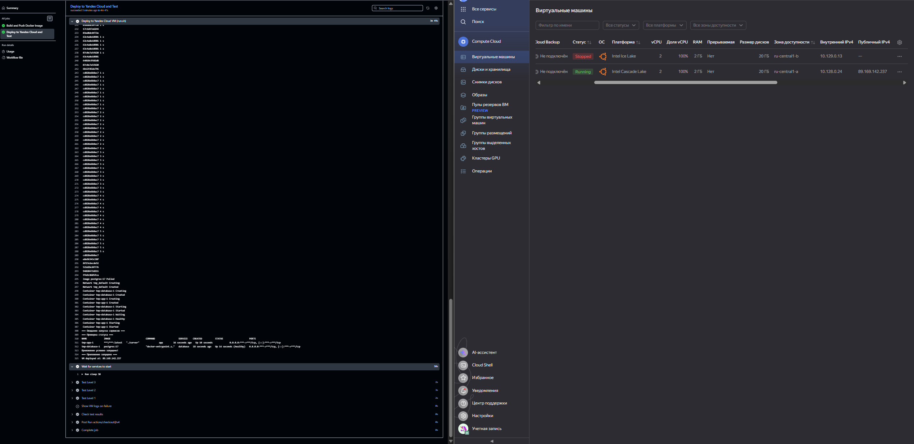
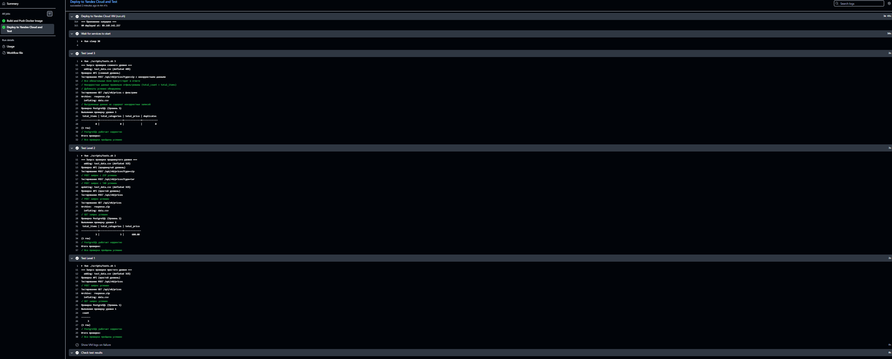

# Финальный проект 1 семестра ИТМО

REST API для работы с ценами супермаркета.
 Сложный уровень.

## Что делает

- POST `/api/v0/prices` — загрузка данных из zip/tar архива с валидацией и проверкой дубликатов
- GET `/api/v0/prices` — выгрузка данных с фильтрами по дате и цене

## Архитектура

```
GitHub Actions
     
     1. Build and Push Docker Image
             Собирает образ → пушит в Docker Hub
     
     2. Deploy to Yandex Cloud and Test
          1 Создаёт VM в Yandex Cloud
          2 VM скачивает образ из Docker Hub
          3 Запускает приложение + PostgreSQL
          4 Прогоняет тесты
```

Я немного изменил архитектуру по сравнению с заданием. Вместо того чтобы собирать образ локально через `prepare.sh`, сборка происходит сразу в CI/CD и образ загружается в Docker Hub. Потом VM в Yandex Cloud просто скачивает готовый образ. Так проще и быстрее.

## Скриншоты

Pipeline успешно прошёл:



VM создалась в Yandex Cloud:



Все тесты прошли:



## Настройка

Все переменные хранятся в GitHub Secrets, внизу перечисление всех переменных, которые используются в проекте


| Секрет | Описание |
|--------|----------|
| `DOCKERHUB_USERNAME` | Логин Docker Hub |
| `DOCKERHUB_TOKEN` | Access Token от Docker Hub |
| `YC_TOKEN` | OAuth токен Yandex Cloud |
| `YC_CLOUD_ID` | ID облака |
| `YC_FOLDER_ID` | ID каталога |
| `YC_ZONE` | Зона (например `ru-central1-a`) |
| `YC_SUBNET_ID` | ID подсети |
| `SSH_PUBLIC_KEY` | Публичный SSH ключ |
| `SSH_PRIVATE_KEY` | Приватный SSH ключ |
| `APP_DB_HOST` | `database` |
| `APP_DB_PORT` | `5432` |
| `APP_DB_NAME` | `project-sem-1` |
| `APP_DB_USER` | `validator` |
| `APP_DB_PASSWORD` | `val1dat0r` |
| `APP_PORT` | `8080` |

## Скрипты

- `prepare.sh` — пустой, см. пояснение внутри
- `run.sh` — создаёт VM, деплоит приложение, возвращает IP
- `tests.sh` — тестирует API


Сервис будет на http://localhost:8080
